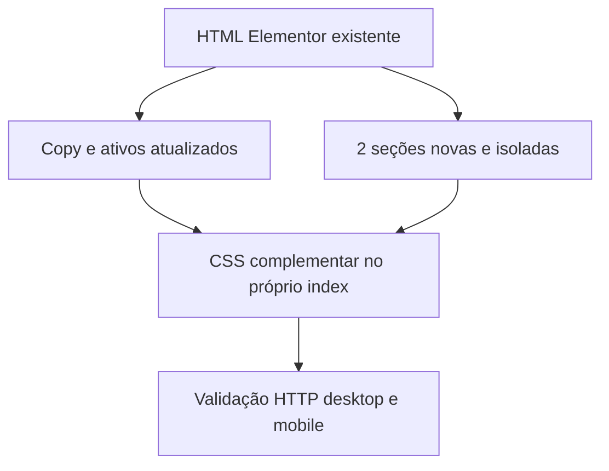

# Nova LP — Design de implementação

**Spec:** `.specs/features/bb-proximo-passo-lp/spec.md`  
**Status:** Aprovado (autoaprovação autorizada pelo solicitante)

## Abordagens consideradas

1. **Aumento cirúrgico da página Elementor — escolhida.** Reaproveita os 16 blocos atuais, injeta somente prova social e passo a passo, usa CSS para a ordem visual e atualiza copy/ativos de forma localizada. Menor risco para tracking, responsividade e scripts achatados.
2. **Reconstrução completa em HTML novo.** Daria controle máximo de semântica e CSS, mas amplia muito o risco de perder comportamento do Elementor, FAQ, lazyload e tracking.
3. **Somente troca de textos.** Mais rápida, porém não atende prova social, passo a passo, ordem de decisão nem tangibilização da oferta.

## Direção visual

- **Conceito:** “próximo passo visível” — cada bloco reduz uma decisão do candidato.
- **Paleta:** Verde Banco `#0E3D2F`, Verde Painel `#0A3125`, Dourado `#F4B740`, Creme `#F4F1E8`, Verde Apoio `#7FB69E`, Vermelho de dor restrito aos balões existentes.
- **Tipografia:** preservar Poppins nos títulos e Open Sans no corpo para não introduzir novo custo de fonte; reforçar contraste por peso e escala.
- **Layout:** seções largas e calmas; cards com borda dourada fina; sequência de processo realmente numerada; feedbacks em trilho horizontal no mobile.
- **Assinatura:** um “cartão do próximo passo” no hero e no bloco de processo, com a linguagem visual do painel de estudos. É o único gesto novo forte; o restante permanece disciplinado.

Revisão antitemplate: foi descartada a aparência genérica de dashboard com dezenas de métricas. O elemento memorável é funcional e específico do produto: abrir e encontrar o estudo do dia.

## Arquitetura

## Reuso

| Componente | Uso |
| --- | --- |
| Seções Elementor atuais | Mantêm estrutura, IDs, breakpoints e acordeão. |
| `sistema-estudos-nobg.webp` | Prova visual do mecanismo e primeiro item da vitrine. |
| `combo-nobg.webp` | Composição dos cinco itens nos cards de preço. |
| `capa-apostila`, `mais-2000-questoes`, `decorex`, `comunidade` | Mockups da vitrine. |
| `autoridade-v4-nobg.webp` | Apoio visual neutro, sem atribuir identidade/cargo. |
| Cinco `feedback*.webp` | Prova social literal, sem copy derivada. |

## Componentes

- **Hero:** copy nova, selos corretos e cartão visual do método; sem CTA.
- **Prova social:** seção customizada entre hero e dor, cinco imagens com `loading=lazy`.
- **Dor e solução:** imagem nova com recorte e bloco fundido “disciplina vs. direção”.
- **FastFood:** seção customizada de três passos com setas, sem claim de minutos.
- **Vitrine:** cards atuais reordenados via `order`; mecanismo primeiro e Decorex destacado.
- **Ancoragem/ofertas:** recapitulação de equivalentes de mercado e dois cards espelhados.
- **Autoridade/decisão:** seção atual reescrita e visualmente reposicionada.
- **FAQ/rodapé:** sete perguntas e disclaimer legal.

## Falhas e mitigação

| Cenário | Mitigação |
| --- | --- |
| Recorte de fundo danifica texto | Gerar alpha local sem redesenhar RGB; validar visualmente. |
| `order` altera layout interno | Aplicar apenas aos filhos diretos da raiz Elementor e testar dois viewports. |
| Lazyload não dispara no screenshot | Manter `src` real, rolar a página durante teste e checar `naturalWidth`. |
| Script adiciona UTMs ao checkout | Validar URL base e aceitar apenas parâmetros de runtime. |

## Riscos e preocupações

| Risco | Impacto | Mitigação |
| --- | --- | --- |
| `index.html` concentra CSS, marcação e scripts em ~450 KB | Edição acidental pode quebrar página inteira. | Backup obrigatório e patches cirúrgicos. |
| Não há suíte automatizada | Regressões visuais/DOM podem escapar. | Gate estrutural por script + validação real no navegador. |
| Autoridade pessoal e dados legais ausentes | Bloco 10 e rodapé não podem atingir versão jurídica final. | Implementar versão honesta sem identidade; reportar dados pendentes. |

